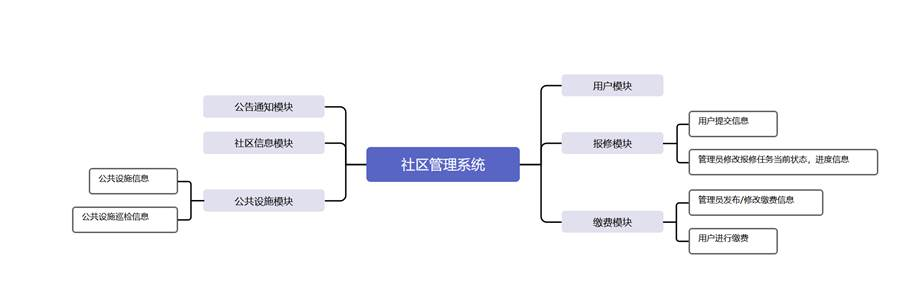
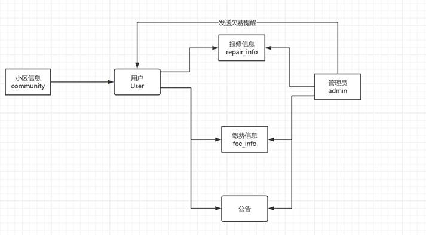

# Graduation-project

##### 项目背景

​	随着国家现代和城镇化的不断进行，我国的城镇居民的比例和数量都在稳步提升。在大规模和小区内容丰富的新型小区中，实行老式的人力密集的人力管理系统由于庞大的住户规模和相较于老式小区更加繁多的小区管理项目，难以在令居民满意的区间内完成小区管理任务。同时高昂的人力成本以及包含纸质办公诸多的其他开销也成为了小区管理的一笔沉重的负担，因此其居民对于小区管理的质量，精度和效率提出了新的要求。

​	另一方面，随着我国的人口老龄化和2000年前后大规模兴建的一批小区各种配套设施相继步入老化，传统小区管理模式在这些小区内也遇上了新的挑战。

​	建立电子化现代化的小区管理系统，能够有效解决现代化小区和老旧小区管理的诸多痛点，具有重要意义。

##### 功能设计

###### 整体功能设计

通过对小区管理实际中住户和管理者需求详细分析后，在经过比较分析已经开发的各种小区管理系统，并结合所采用的软件开发技术的基础上，将软件基础功能分为用户模块，报修模块，公告通知模块，公共设施模块，缴费模块，小区信息模块。其中用户模块，公告模块，报修模块使用较为频繁。软件模块的功能架构如图 所示：

                图2.2 软件基础功能架构

过对于小区管理实际流程的分析研究，本软件分为三个模块以实现完整功能：前端交互界面，后端数据管理，以及包括数据库等依赖管理模块。重点考虑实际小区管理过程中普通住户和小区管理人员的需差别，在前后端都进行权限设置，确保对于不会发生权限之外的错误操作。

###### 前端用户界面

1、非登录查看内容

考虑到日常使用过程中常常需要查看一些非敏感的信息，小区管理系统也需要向外展示一些基本信息向外展示小区的基本形象，包括小区的基本建筑/住户等信息

2、用户登录及登录拦截板块：

用户通过预设好的账号密码登录、若该登录失效，用户无法再查看登录限定的内容并会被提示重新登录，对于管理员限定的操作内容，界面则会进行动态显示，不向普通显示对应内容避免进行误操作。

3、小区信息模块

以不同建筑为单位存储的小区信息，用户/游客可以在此查看小区基本信息，管理员则可以通过该模块对不同建筑的信息进行新增/删除/修改/查看

4、公告模块

按照实现排序显示不同公告，用户/游客可以在此查看小区基本信息，管理员则可以通过该模块对不同公告的信息进行新增/删除/修改/查看

5、报修模块

用户可以看到自己提交全部报修记录并且可以新增报修记录，管理员可以查看全部用户提交的报修记录，并且修改报修的状态和进度信息以实现和用户的互动。

6、公共设施模块

以设施为单位展示设施本身相关信息及其对应的维修巡检记录，用户可以查看不同公共设施的相关信息和设施的维修巡检情况，管理员则是可以新增/删除/修改/查看对应公共设施信息及其对应的巡检记录

7、缴费模块

用户可以查看自身的缴费记录，并支付未支付的相关费用，用户的用户信息也会显示当前的待缴费用。管理员则可以新增/删除/修改/查看所有用户的缴费信息。

###### 后端数据管理

1、登录及登录拦截板块：

管理员通过预设好的账号密码登录、若该登录失效，则返回错误信息。用户使用账号密码登录后，服务器需要对用户之后的每次请求进行登录有效性和权限的判断，并返回对应的信息。

2 用户模块：

新增，删除，修改用户信息，同时对于密码进行加密存储

3、小区信息模块

用来管理用户信息，管理员可以进行新增/删除/修改/查看，用户则只能修改自己的用户信息

4、公告模块

用来管理公告信息

5、报修模块

用来管理用户信息，管理员可以进行新增/删除/修改/查看，查看端口进行用户身份判断，普通用户返回自己提交全部报修记录并且可以新增报修记录，管理员可以返回全部用户提交的报修记录

6、公共设施模块

管理设施本身相关信息及其对应的维修巡检记录，允许用户可以查看不同公共设施的相关信息和设施的维修巡检情况，管理员则是可以调用新增/删除/修改/查看对应端口处理对应公共设施信息及其对应的巡检记录，再修改巡检记录状态时也会同步的修改对应的待处理任务状态

7、缴费模块

管理用户缴费记录，允许用户查看自身记录，管理员则可以调用新增/删除/修改/查看所有用户的缴费信息。如果支付金额或是支付状态发生变化，应当对应修改用户的待支付金额。

##### 技术介绍

###### 前端

以React为基础，学习使用了Redux存储数据，react-boostrap提供样式

###### 后端

以Springboot为基础，使用SrpingSecurity + Jwt 实现鉴权

######  数据库

使用Mysql存储数据，Redis作为数据库缓存并尝试使用了Redis-cluster

###### 部署

使用docker进行部署，学习使用了通过 linux 脚本+docker compose + docker file 进行便利的部署使用。

##### 结语

作为在大学四年的总结，在这个项目中我总结运用的四年来各方面的知识，特别是前端，后端和项目部署方面的知识。希望以此来为四年来充实而难忘的大学生生活画上一个句号。